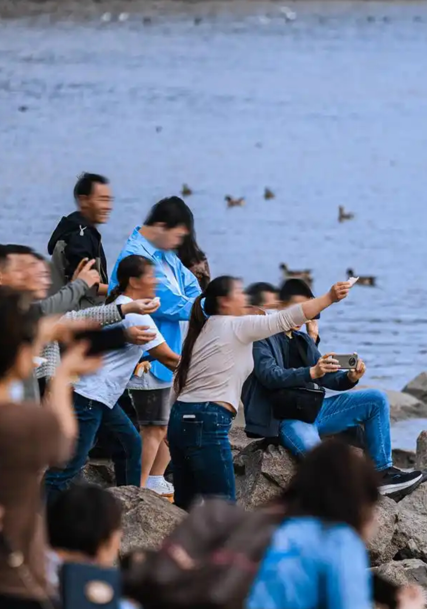
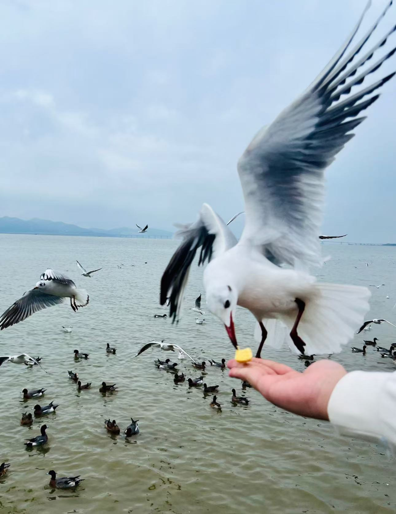

Hong Kong has always enforced strict Wild Animals Protection Ordinances. This year’s revised version has come into effect, greatly increasing penalties for illegal feeding of wild animals, including birds. The maximum penalty is a fine of HKD 100,000 and one year in prison. Additionally, a fixed fine of HKD 5,000 can now be immediately issued, making it much more effective in deterring such behavior. With this awareness in mind, and out of a desire to explore how Shenzhen handles the issue of feeding wild birds and related legislation, I participated in a bird protection campaign today.

As I arrived at the coastal trail, I was drawn to a group of elegantly dressed girls taking photos. What caught my attention, however, wasn’t their outfits but their uncivilized behavior—they were holding up pieces of bread, waving them high to attract the shorebirds circling nearby. The birds’ wide, snow-white wings flapped constantly, creating an undeniably beautiful scene. A photographer encouraged the girls to keep feeding the birds, allowing him to capture more stunning shots. Some passersby stopped to admire the scene, and I couldn’t help but worry that such moments, especially when shared on social media, would inspire others to imitate this destructive behavior.

I approached the girls and explained why their actions were problematic. According to the Wildlife Protection Law of the People’s Republic of China, it is prohibited and restricted to interfere with or threaten the breeding and survival of wild animals in nature reserves. Since this law might seem rather complicated, I carefully explained the specific consequences of illegal feeding: how it can cause diseases in birds, disrupt their natural foraging habits, and harm their overall well-being.

After successfully stopping the girls, I noticed another group of seniors throwing corn kernels to the waterbirds on the mudflats. When I tried to stop them, they argued, claiming that feeding wild animals in winter is an act of kindness according to their Buddhist beliefs. This encounter made it clear to me that there is an urgent need to dispel and clarify superstitions, promote scientific knowledge, and encourage a civilized mindset of harmony with nature.

Finally, I spotted a hawker riding a bicycle, going around selling bird food to tourists via QR code payments. I bravely chased after him, confronted him, and left him with the park’s management staff for further action.

On my way home, I kept reflecting. On one hand, stronger legislation is needed—like in Hong Kong, where the Agriculture, Fisheries and Conservation Department can issue an immediate fine of 5,000 HKD without prior warning. On the other hand, environmental education must be prioritized, so people no longer see feeding birds as something beautiful, joyful, or even virtuous, but rather as something shameful and harmful.