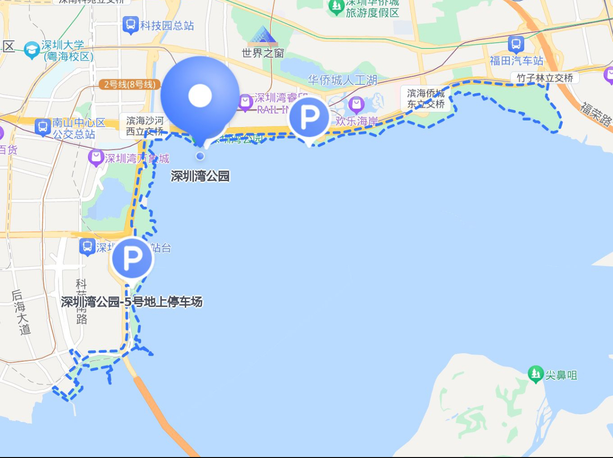
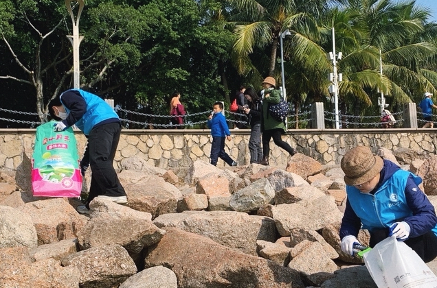

Today, the temperature dropped, and I braved chilly winds to participate in the “Beach Cleanup Campaign” at Shenzhen Bay.

Shenzhen Bay Park is located along the southwestern coast of Shenzhen in Guangdong Province. It stretches from the Futian Mangrove Bird Nature Reserve in the east to Wanghai Road in the west, bordered by the Hongkong-Shenzhen Cross-Sea Bridge to the south and Binhai Avenue to the north. Unfortunately, during the early stages of Shenzhen’s development as a Special Economic Zone over 40 years ago, environmental awareness was weak. This resulted in the mangrove forest area shrinking by more than half, leading to significant declines in both resident birds and migratory birds that come here in winter. Therefore, protecting and cleaning the coastline to provide a good ecological environment for plants and animals is now critically important.

Unlike Hong Kong’s Mai Po Nature Reserve—where visitors are rare, and daily numbers are capped at 200 people—Shenzhen Bay Park sits right next to the bustling city and receives nearly 20 million visitors annually.

With tools to clean up coastal trash, I was shocked by what I saw when I reached the beach. The problem of tourists littering was worse than I’d imagined—plastic bags from convenience food, soda cans, glass beer bottles, milk cartons… and the most common of all? Cigarette butts.

With the constant crashing of the waves, much of the trash was lodged deep in the crevices of the crisscrossing rocks. Digging them out felt like a “treasure hunt”  and took quite a bit of effort.

Our meticulous beach cleanup silently influenced some visitors: some quietly put away bottles they had been about to toss, while others cast us sincere and approving glances.

From now on, every time I look at the blue ocean and the vast, clean, beautiful beach, I will remember that if we don’t take immediate action to protect them, such beauty will not last forever. My friends, keep the beauty of the sea in your memory, but don’t leave your marks on the shore.

